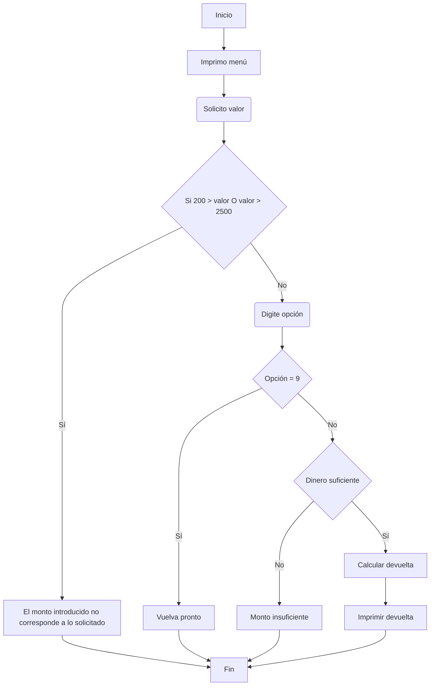

# Taller02

Una máquina dispensadora de comidas tiene un menú con los productos ofrecidos y su precio así:

```text
Máquina Dispensadora "El Puente"
    1. Papas Fritas $1200
    2. Sándwich Combinado $2500
    3. Pescadito $1800
    4. Empanada $1700
    5. Arepa $2000
    6. Gaseosa $1600
    7. Vaso de Té $1000
    8. Dulce $200
    9. Salir
Digite su opción >
```

La máquina trabaja con monedas de 500, 200 y 100. Elabore un programa en C que simule el comportamiento de la máquina, solicitando inicialmente el valor del dinero al usuario; tenga en cuenta que el valor ingresado mínimo es de $200 y el máximo de $2500. Si el valor es válido se debe desplegar el menú con las opciones de comidas disponibles, para que se seleccione la opción correspondiente, una vez ingresada la opción deseada el algoritmo debe informar si se dispensa el producto y la devolución correspondiente en la cantidad de monedas de cada valor necesarias, el dinero a devolver debe consistir en la mayor cantidad posible en monedas de mayor valor. Por ejemplo si se ingresa a la máquina $2400 y se solicita una gaseosa, la máquina le debe devolver $800, en 1 moneda de $500, una moneda de $200 y una moneda de $100.

## Refinamiento 1
1. Declaro variables.
2. Solicito valor inicial al usuario.
3. Valor válido.
    1. No, retorno 0.
    2. Sí, desplegar menú.
4. Solicitar producto.
5. Calcular devuelta e imprimir. 

## Refinamiento 2




## Refinamiento 3
1. Declaro variable `valor`, `m500`, `m200`, `m100`, `op`, `saldo`.
2. Imprimo menú.
3. Solicito valor al usuario.
4. Asigno monto a `valor`.
5. Si 200 > `valor` || `valor` > 2500.
    1. Sí, retorno 0.
    2. No, solicito producto.
6. Asigno valor a `op`.
7. Asigno valor a `precio`.
8. Si `op` = 9, imprimir "Gracias por su visita, vuelva pronto"
8. Si `op` =! 9.
    1. Si `valor` < opción
        1. Sí, imprimir "Saldo insuficiente, intente de nuevo"
        2. No, calcular devuelta.
8. Calcular `saldo`.
9. Calcular monedas de 500 y asignar variable `m500`.
10. Calcular monedas de 200 y asignar variable `m200`.
11. Calcular monedas de 100 y asignar variable `m100`.
12. Imprimir resultado. 

