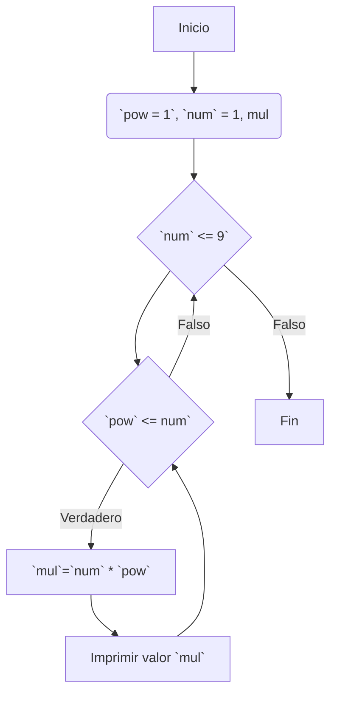
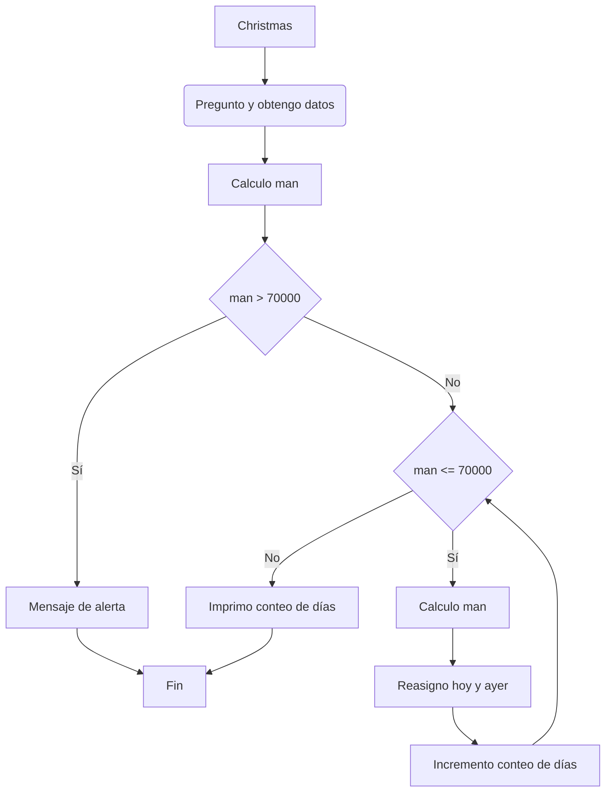
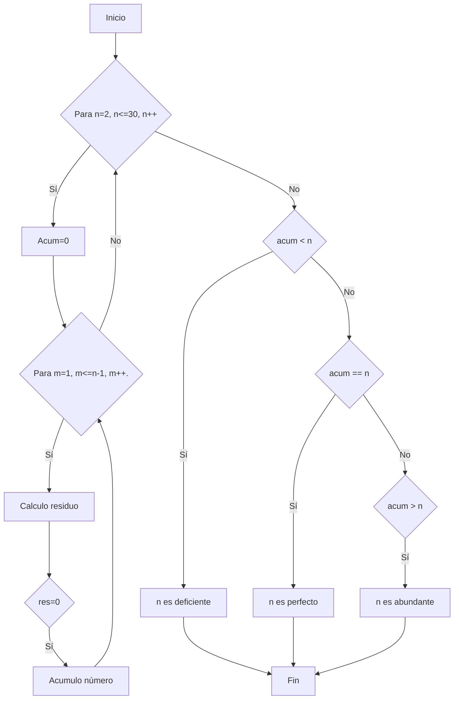

# Tabla de multiplicación
Escriba un programa en C/C++ para escribir la siguiente tabla de multiplicación:
``` text
1
2 4
3 6 9
4 8 12 16
5 10 15 20 25
6 12 18 24 30 36
7 14 21 28 35 42 49
8 16 24 32 40 48 56 64
9 18 27 36 45 54 63 72 81
```

## Refinamiento 1
1. Declaro variables.
2. Imprimo tabla. 

## Refinamiento 2


## Refinamiento 3
1. Declaro `num`= 1, `pow`= 1, `mul`.
2. Para Para `num` <= 9.
    1. Para `pow` <= `num`.
        1. `mul` = `num` * `pow`
        2. Imprimo `mul`
        3. Incremento en 1 a `pow`.
    2. Incremento en 1 a `num`.
    3. Asigno valor 1 a `pow`.
    4. Inicio nueva línea de texto. 
3. Return 0

# Conejos
En la población de la isla de Taporu están muy preocupados debido a que tienen que convivir con conejos y éstos se reproducen rápidamente. Los conejos se reproducen según la fórmula: 
    𝑃𝑡+1 = 𝑃𝑡 + 𝑃𝑡−1
Es decir, la población de conejos de mañana es igual a la población conejos de hoy más la de ayer. Ellos se reunieron y tomaron la decisión que cuando dicha población sobrepase los 70000 van a enviar 40000 conejos a la isla vecina. Ellos quieren saber, dada la población de ayer y de hoy, en cuánto tiempo tendrán que realizar la exportación de conejo.

## Refinamiento 1
1. Declaro variables. 
2. Solicito valores de población de ayer y hoy. 
3. Imprimo resultados. 

## Refinamiento 2 


## Refinamiento 3
1. Declaro variables `ayer`, `hoy`, `man`, `d=0`.
2. Solicito población de ayer.
3. Asigno valor a variable `ayer`.
4. Solicito población de hoy.
5. Asigno valor a variable `hoy`.
6. Calculo `man`.
7. Si `man` > 70000.
    1. Imprimir mensaje de alerta.
8. Si `man` <= 70000.
    1. Para `man` <= 70000.
        1. Calculo `man`.
        2. Reasigno valor `ayer`.
        3. Reasigno valor `hoy`.
        4. Incremento `d` en 1. 
    2. Imprimo resultados.
9. Retorno 0.

# Números deficientes, perfectos y abundantes
Los divisores propios de un número entero n son los divisores positivos menores que n. Un entero positivo se dice que es un número deficiente, perfecto o abundante, si la suma de estos divisores propios es menor que, igual a, o mayor que el número respectivamente.
Ejemplo: 8 es deficiente porque 1 + 2 + 4 < 8; 6 es perfecto porque 1 + 2 + 3 = 6; 12 es abundante porque 1 + 2 + 3 + 4 + 6 > 12. Elabore un programa que encuentre e imprima los números deficientes, perfectos y abundantes entre 1 y 30.

## Refinamiento 1
1. Declaro variables.
2. Imprimo resultados. 

## Refinamiento 2


## Refinamiento 3
1. Declaro variables `n`, `m`, `res`, `acum`. 
2. Para `n` = 2; `n` <= 30; `n`++.
    1. Asignar valor `acum` = 0.
    2. Para `m` = 1; `m` <= `n`-1; `m`++.
    3. Calculo `res`. 
    4. Si `res` = 0.
        1. Calculo `acum`.
3. Si `acum` < `n`.
    1. Imprimo resultado de número deficiente.
4.  Si `acum` == `n`.
    1. Imprimo resultado de número perfecto.
5.  Si `acum` > `n`.
    1. Imprimo resultado de número abundante. 