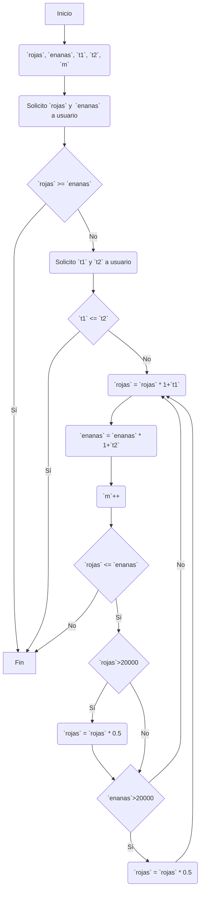

# Hormigas
En la Isla del Edén viven dos poblaciones de hormigas, las rojas y las enanas. La población de rojas (A) es menor que la población de enanas (B). Sin embargo, la población A está creciendo más rápido que la población B. Escriba un programa que solicite al usuario que  ingrese la cantidad de hormigas y la tasa de crecimiento mensual de cada población. El programa debe generar después de cuántos meses la población A será mayor o igual que la población B y las cantidades de hormigas de ambas poblaciones en ese momento. Tenga en cuenta que cuando las poblaciones de hormigas son superiores a 20,000, comienza a haber problemas de alimentación lo que hace que se reduzca la tasa de crecimiento en un 50% mensual. 
Por ejemplo, si la entrada de muestra es: población A = 5,000, tasa de crecimiento de la  población A = 5%, población B = 8,000 y tasa de crecimiento de la población B = 2%, se obtiene que el número de meses necesario para que la población A supere o sea igual a la población B es 17 meses y las cantidades de hormigas serán de 11,447 y 11,192 respectivamente (Nota: No se consideran poblaciones con número decimales, dado que no puede existir una parte de la hormiga).

## Refinamiento 1
1. Declaro variables.
2. Solicito valores.
3. Condicionales de errores de datos.
4. Conteo de meses.
5. Reducción mensual si hay más de 20000 hormigas.
6. Imprimo resultados.

## Refinamiento 2

## Refinamiento 3
1. Declaro variables `rojas`, `enanas`, `t1`, `t2`, `m`.
2. Solicito valor hormigas rojas al usuario.
3. Asigno valor a `rojas`.
4. Solicito valor hormigas enanas al usuario. 
5. Asigno valor a `enanas`.
6. Si `rojas` >= `enanas`
    1. Sí, imprimir mensaje de error.
7. Solicito valor tasa de crecimiento hormigas rojas al usuario.
8. Asigno valor a `t1`.
9. Solicito valor tasa de crecimiento hormigas rojas al usuario.
10. Asigno valor a `t2`.
11. Si `t1` < `t2` 
    1. Sí, imprimir mensaje de error. 
12. Para `rojas`<=  `enanas` 
13. `rojas` = `rojas` * (1+`t1`)
14. `enanas` = `enanas` * (1+`t2`)
15.  `m`++
16. Si rojas > 20000
    1. Sí, `t1` = `t1` * 0.5
17. Si enanas > 20000
    1. Sí, `t2` = `t2` * 0.5
18.  Si `enanas` > 20000
    1. Sí, `enanas` = `enanas` * 0.5
19. Imprimo resultados. 

# Números
Sea n = ak ak-1 ak-2 ... a1 a0 un número entero, donde ak ak-1 ak-2 ... a1 a0 representan  cada uno de los dígitos del número n. Sea s = ak + ak-1 + ak-2 + … + a1 + a0 la suma de los dígitos de n. Se sabe que n es divisible entre 9 si y sólo si al realizar sumas sucesivas de los  dígitos de s hasta obtener un solo dígito, éste último es igual a 9. Por ejemplo, suponga que n = 27193257. Entonces, el primer s = 2 + 7 + 1 + 9 + 3 + 2 + 5 + 7 = 36. Como el resultado tiene dos dígitos, se suman nuevamente los dígitos obteniendo un nuevo s = 3 + 6 = 9. Dado que este resultado tiene un único dígito y es igual a 9, se puede deducir que 27193257 es divisible por 9. Escriba un programa que le solicite al usuario que ingrese un número entero positivo y luego use el criterio anterior para determinar si el número es divisible entre 9. Adicionalmente, se debe mostrar por pantalla el resultado de cada iteración.

## Refinamiento 1
1. Declaro variables.
2. Solicito valor a usuario.
3. Calculo resultado.
4. Imprimo resultados. 

## Refinamiento 2
1. Declaro variables `num`, `cif`, `sum`
2. Solicito valor a usuario.
3. Asigno valor a `num`.
4. Asigno valor `num` a `cif`.
5. Para `cif` > 0
    1. Para `cif` > 0 
        1. Sumo el módulo 10 de `cif` a `sum`
        2. Asigno `cif` dividido en 10
        3. Imprimo resultados
    2. Asigno valor `num` a `cif`.
    3. Asigno valor 0 a `sum`
    4. Imprimo resultados
6. Si `sum` == 9
    1. Sí, imprimo resultado de múltiplo de 9.
7. Sino, si `sum` != 9 
    1. Imprimo resultado de no es múltiplo de 9. 
