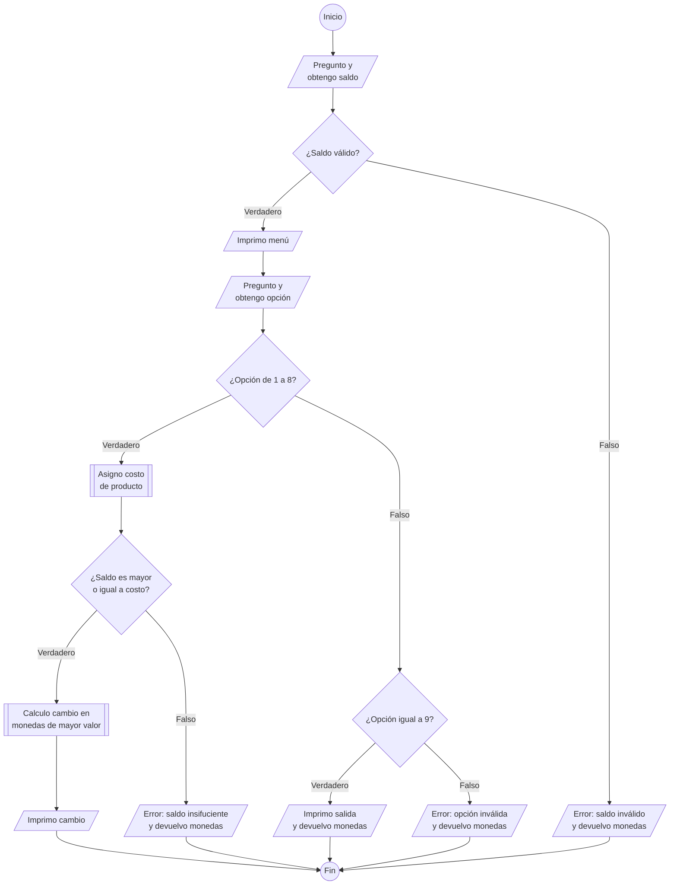

# Máquina Dispensadora 

Una máquina dispensadora de comidas tiene un menú con los productos ofrecidos y
su precio así:

```text
Máquina Dispensadora “El Puente”
1 Papas Fritas		$1200
2 Sándwich Combinado	$2500
3 Pescadito 		$1800
4 Empanada 		$1700
5 Arepa			$2000
6 Gaseosa		$1600
7 Vaso de Té 		$1000
8 Dulce 		 $200
9 Salir
Digite su opción > 
```

La máquina trabaja con monedas de 500, 200 y 100. Elabore un programa en C que
simule el comportamiento de la máquina, solicitando inicialmente el valor del
dinero al usuario; tenga en cuenta que el valor ingresado mínimo es de $200 y
el máximo de $2500. 

Si el valor es válido se debe desplegar el menú con las opciones de comidas
disponibles, para que se seleccione la opción correspondiente, una vez
ingresada la opción deseada el algoritmo debe informar si se dispensa el
producto y la devolución correspondiente en la cantidad de monedas de cada
valor necesarias, el dinero a devolver debe consistir en la mayor cantidad
posible en monedas de mayor valor. 

Por ejemplo si se ingresa a la máquina $2400 y se solicita una gaseosa, la
máquina le debe devolver $800, en 1 moneda de $500, una moneda de $200 y una
moneda de $100

## Refinamiento 1

1. Pregunto y obtengo del usuario saldo.
1. Si saldo ingresado es válido (de 200 a 2500 y múltiplos de 100), imprimo
   menú y pregunto opción de producto:
   1. Si obtengo opción de producto válida (de 1 a 8 y costo de producto menor
      o igual a saldo ingresado por el usuario), entrego producto y devuelvo
      saldo a usuario en monedas de mayor valor.
   1. De lo contrario, si usuario escoge salir (opción 9), imprimo salida y
      davuelvo saldo.
   1. De lo contrario (opción inválida) informo error a usuario.
1. De lo contrario (saldo inválido) imprimo error de saldo no aceptado y
   devuelvo monedas.

## Refinamiento 2

<div class="center">


</div>

1. Pregunto y obtengo del usuario `saldo`.
1. Si `saldo` ingresado es válido (de 200 a 2500 y múltiplos de 100):
   1. Imprimo en pantalla el menú de opciones de comidas y pregunto a usuario
      por opción.
   1. Obtengo del usuario `opcion` de producto
   1. Si `opcion` escoge producto(de 1 a 8):
      1. Asigno valor de producto a `costo`.
      1. Si `costo` de producto es menor o igual a `saldo`:
         1. Imprimo en pantalla la entrega del producto.
         1. Calculo monedas de mayor valor e imprimo cambio de monedas.
      1. De lo contrario (`costo` es mayor a `saldo`):
         1. Imprimo error de saldo insuficiente.
   1. De lo contrario, si usuario escoge salir (`opcion` igual a 9):
      1. Imprimo salida y devuelvo monedas.
   1. De lo contrario (opción escogida **no** es válida):
      1. Imprimo en pantalla error por escoger opción que no se encuentra de 1
      a 9.
1. De lo contrario (saldo inválido):
   1. Imprimo error de monto no aceptado y devuelvo monedas.


# Taller05

Usando como punto de partida la solución propuesta para el taller02[2], modifica el programa usando las siguiente funciones:

menuComida: imprime en pantalla las opciones de comida y retorna la opción escogida por el usuario.
asignarCosto: recibe opción de menú validado y retorna costo de producto.
cambioMonedas: recibe costo de producto y saldo a favor; imprime en pantalla cambio en monedas de mayor valor.

## Refinamiento 3

1. Declaro función `menuComida`
1. Declaro función `asignarCosto`
1. Declaro función `cambioMonedas`
1. Declaro variable `saldo` de tipo _unsigned int_.
1. Declaro variable opcion de tipo _unsigned int.
1. Declaro variable `opcion` de tipo _unsigned short.
1. Pregunto al usuario cantidad de dinero.
1. Obtengo del usuario  cantidad de dinero y asigno a `saldo`.
1. Si `saldo >= 200 && saldo <= 2500 && saldo % 100 == 0`:
   1. Invoco función `menuComida`
   1. Si `opcion >= 1 && opcion <= 8`:
      1. Invoco función `asignarCosto`
      1. Si `costo <= saldo`:
         1. Invoco función `cambioMonedas`
      1. De lo contrario (`costo` es mayor a `saldo`):
         1. Imprimo error de saldo insuficiente.
   1. De lo contrario, si `opción == 9` (usuario escoge salir):
      1. Imprimo salida y devuelvo monedas.
   1. De lo contrario (opción escogida **no** es válida):
      1. Imprimo en pantalla error por escoger opción que no se encuentra de 1
         a 9.
1. De lo contrario (saldo inválido):
   1. Imprimo error de monto no aceptado y devuelvo monedas.


## Refinamiento función `menuComida`
Imprime en pantalla las opciones de comida y retorna la opción escogida por el usuario.

### Entradas: 
void.

### Salidas:
`op`: entero positivo que representa opción elegida por el usuario.

1. Declaro `opción` unsigned short
1. Imprimo en pantalla encabezado de menú.
1. Imprimo en pantalla entrada de menú 1.
1. Imprimo en pantalla entrada de menú 2.
1. Imprimo en pantalla entrada de menú 3.
1. Imprimo en pantalla entrada de menú 4.
1. Imprimo en pantalla entrada de menú 5.
1. Imprimo en pantalla entrada de menú 6.
1. Imprimo en pantalla entrada de menú 7.
1.Imprimo en pantalla entrada de menú 8.
1. Imprimo en pantalla entrada de menú 9.
1. Pregunto al usuario `op`.
1. Obtengo del usuario `op` de producto.
1. Retorno `op` elegida. 

## Refinamiento función `asignarCosto`
Recibe opción de menú validado y retorna costo de producto.

### Entradas:
`opcion`: entero positivo que representa opción elegida por el usuario.

### Salidas: 
`costo`: entero positivo que representa el costo de la opción elegida por el usuario.
 
1. Obtengo del usuario opcion de producto. 
1. Si `opcion` >= 1 && `opcion` <= 8:
1. Declaro variable costo de tipo unsigned int.
1. Si `opción` == 1:
    1. Asigno 1200 a `costo`
1. Si `opción` == 2:
    1. Asigno 2500 a `costo`
1. Si `opción` == 3:
    1. Asigno 1800 a `costo`
1. Si `opción` == 4:
    1. Asigno 1700 a `costo`
1. Si `opción` == 5:
    1. Asigno 2000 a `costo`
1. Si `opción` == 6:
    1. Asigno 1600 a `costo`
1. Si `opción` == 7:
    1. Asigno 1000 a `costo`
1. Si `opción` == 8:
    1. Asigno 200 a `costo`
1. Retorno `costo`. 

## Refinamiento función `cambioMonedas`
Recibe costo de producto y saldo a favor; imprime en pantalla cambio en monedas de mayor valor.

### Entradas: 
`costo`: entero positivo que representa el costo de la opción elegida por el usuario.
`saldo`: entero positivo que representa el cambio devuelto al usuario. 

### Salidas:
void.

1. Si `costo` <= `saldo`:
2. Imprimo en pantalla la entrega del producto.
3. Resto a saldo el `costo` del producto y asigno a `saldo`.
4. Declaro variable `m500` de tipo unsigned char.
5. Declaro variable `m200` de tipo unsigned char.
6. Declaro variable `m100` de tipo unsigned char.
7. Imprimo encabezado de cambio.
8. Calculo cantidad de de monedas de quinientos (`saldo` / `500`) y asigno a `m500`.
9. Calculo nuevo `saldo` (`saldo` %= `500`).
10. Imprimo cantidad de monedas de quinientos `m500`.
11. Calculo cantidad de de monedas de docientos (`saldo` / 200) y asigno a `m200`.
12. Calculo nuevo `saldo` (`saldo` %= 200).
13. Imprimo cantidad de monedas de docientos `m200`.
14. Calculo cantidad de de monedas de cien (saldo / 100) y asigno a `m100`.
15. Calculo nuevo `saldo` (`saldo` %= 100).
16. Imprimo cantidad de monedas de cien `m100`.
