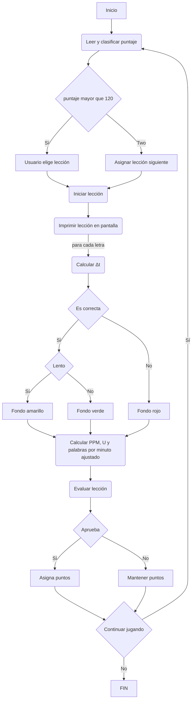

# Proyecto Final

## Constantes:
- LECCIONES = 12
- COLUMNAS = 50
- FILAS = 5
- LARGO = 5

## Estructuras y matrices: 

### Matriz: `usuario`
Matriz de tipo `Caracter` 5 * 50 que almacena palabras espacios y saltos de linea.

### Estructura enum: `ParColor`
- PAR_OK `Para rapido`
- PAR_WAR `Para lento`
- PAR_ERR `Para error`

### Estructura: `Caracter`
- char `letra`
- float `tiempo`
- bool `acierto` 

### Estructura: `Leccion`
- Arreglo char `nombre`.
- unsigned `AdjWPM`
- unsigned `a`
- unsigned `cantWord`
- Matriz char `palabras`

### Arreglo double `pre`
- 0: s (tiempo total en segundos)
- 1: T (Longitud lección)
- 2: ppm (Palabras por minuto)
- 3: E (Cantidad de errores)
- 4: pe (Proporción de error)
- 5: ppma (Palabras por minuto ajustado)

## Funciones: 

### Función `confTerm`:
Determina si la terminal soporta el color. 

### Función `demoDeltaT`:
Recibe cada letra ingresada por el usuario, evalúa caracter en funcion de la matriz usuario para comparar y determinar color de fondo e imprime.

#### Entradas:
`campPtr`: Pantalla de interacción.
`notfPtr`: Pantalla de notificación.
`usuario`: Estructura de tipo Caracter.  
`p`: Arreglo double. 

#### Salidas: 
void. 

#### Pseudo-codigo:

1. Declaro estructura `timeval` para medir tiempos de inicio y fin.
1. Declaro variable `c` tipo char para almacenar los caracteres ingresados.
1. Limpio pantalla de notificacion.
1. Imprimo nuevo mensaje en ventana de notificación.
1. Inicializo puntero en posicion 9, 10. Inicio de la leccion.
1. Refresco pantallas.
1. Desde i = 0, hasta i < FILAS, incremento i mas 1.
    1. Desde j = 0, hasta j < FILAS, incremento j mas 1.
        1. Obtengo caracter de usuario contando segundos de inicio y fin.
        1. Declaro variable selColor de tipo estructura color.
        1. Escaneo y asigno tiempo a `deltaT`.
        1. Asigno tiempo a tiempo en estructura usuario.
        1. Evalúo si la letra es correcta.
            1. Si el caracter es diferente: Se imprime con fondo rojo. Se asigna 0 a acierto en usuario.
            1. Si el caracter es igual pero deltaT mayor o igual a 0.8 segundos: Se imprime con fondo amarillo, y cantidad de errores resta 1.
            1. Si el caracter es igual pero deltaT menor a 0.8 segundos: Se imprime con fondo verde, y cantidad de errores resta 1.

        1. Si caracter es igual a 27, el programa finaliza.
        1. Si el siguiente caracter de la matriz usuario.letra es igual a \n y i mas 1 es menor a FILAS.
            1. i aumenta en 1.
            1. j igual a -1.
            1. Apuntador se mueve a ubicacion i, j.
        1. Si el siguiente caracter de la matriz usuario.letra es igual a \n y i mas 1 es mayor o igual a FILAS.
            1. i igual a FILAS.
            1. j igual a COLUMNAS
        1. Imprime tiempo deltaT en ventana notificacion.
        1. Refresca pantallas.

### Función: `nombreLeccion`
Lee de un archivo de texto el puntaje y según este asigna lección.

#### Entradas:
`nombre`: string con nombre de lección.
`campPtr`: Ventana general.

#### Salidas:
`puntaje`: entero que almacena puntaje.

#### Pseudo-codigo:

1. Declaro variable `puntaje`
1. Abro archivo de texto que almacena progreso.
1. Abre archivo
    1. No, finaliza programa.
    1. Sí
        1. Leo puntaje de archivo de texto
        1. `puntaje` <130
            1. Sí, modifico nombre lección.
            1. No, imprimo menú.
                1. Leo opción solicitada.
                1. Modifico nombre lección. 
        1. Cierro archivo de texto.
        1. Retorno `puntaje`.
    
```text
0 = filaCentralI
10 = filaCentralII
20 = filaCentralIII
30 = filaSuperiorI
40 = filaSuperiorII
50 = filaSuperiorIII
60 = filaInferiorI
70 = filaInferiorII
80 = filaInferiorIII
90 = filaNumerosI
100 = filaNumerosII
110 = filaNumerosIII
>120 = a elección
``` 

### Función: `cargarLeccion`
Lee de un archivo de texto la lección y asigna valores en estructura `leccion`.

#### Entradas:
`nombre`: string con nombre de lección.
`campPtr`: ventana general.

#### Salidas: 
`leccion`: Estructura de tipo Leccion.

#### Pseudo-codigo:

1. Abro archivo de texto que almacena lección a evaluar.
1. Abre archivo
    1. No, finaliza programa.
    1. Sí.
        1. Leo nombre de la lección, palabras por minuto ajustado, penalización y cantidad de palabras. 
        1. Leo palabras de la lección.
        1. Cierro archivo. 

### Funcion: `imprimirLeccion`
Imprime lección a evaluar con palabras aleatorias de la estructura `leccion`, almacenadas en la matriz usuario.

#### Entradas:
`leccion`: Estructura de tipo Leccion.
`usuario`: Matriz de tipo Caracter.
`campPtr`: Ventana general.
`p`: Arreglo de datos.

#### Salidas: 
void.

#### Pseudo-codigo:

1. Limpio ventana general
1. Declaro `i` = 0, `pos` y `tam`.
1. Desde i = 0, i menor a FILAS, incremento i mas 1.
1. Declaro `j` = 0.
1. Desde j = 0, j menor a FILAS, incremento j mas 1.
    1. Obtengo número aleatorio entre 0 y cantidad de palabras de la lección. Asigno a `pos`.
    1. Mido tamaño de palabra en `pos`
    1. Si la palabra cabe en la fila
        1. Recorro k tamaño de palabra.
            1. Guardo cada caracter de la palabra en matriz usuario.
            1. Imprimo en ventana general, en posicion i*2, j el caracter guardado.
            1. Actualizo `j` mas 1.
            1. Actualizo `p[1]` mas 1.

            1. Si j + 3 es menor a COLUMNA.
                1. Guarda caracter ` ` espacio en matriz usuario.
                1. imprime caracter.
                1. Actualizo `j` mas 1.
                1. Actualizo `p[1]` mas 1.
    1. Si la palabra no cabe en Fila.
        1. Asigno caracter `\n` salto de linea a matriz usuario.letra.
            1. Recorro k tamaño de palabra.
            1. Guardo cada caracter de la palabra en matriz usuario.
            1. Imprimo en ventana general, en posicion i*2, j el caracter guardado.
            1. Actualizo `j` mas 1.
            1. Actualizo `p[1]` mas 1.

            1. Si j + 3 es menor a COLUMNA.
                1. Guarda caracter ` ` espacio en matriz usuario.
                1. imprime caracter.
                1. Actualizo `j` mas 1.
                1. Actualizo `p[1]` mas 1.
            1. Si i iguala o pasa a FILAS. Break
    1. Incremento i mas 1.

### Función `finTerm`:
Cierra pantallas. 

### Función `calcularResultados`:
Calcula y almacena palabras por minuto, proporción de error y palabras por minuto ajustado.

#### Entradas:
`p`: Arreglo double. 
`leccion`: Estructura de tipo Leccion.

#### Salidas: 
void.

#### Pseudo-codigo:

1. Calculo ppm.
1. Calculo proporción de error.
1. Calculo palabras por minuto ajustado. 

### Función `reporte`:
Imprime resultados obtenidos.

#### Entradas:
`campPtr`: Pantalla de interacción.
`p`: Arreglo double. 
`lec`: Estructura de tipo Leccion.

#### Salidas: 
`r`: Entero que determina si aprobó o no la lección.

#### Pseudo-codigo:

1. Limpio pantalla campPtr.
1. Imprimo lección evaluada.
1. Imprimo PPM.
1. Imprimo proporción de error.
1. Imprimo palabras por minuto ajustado.

1. Aprueba lección.
    1. Sí
        1. Imprimo lección aprobada.
        1. Asigno 1 a `r`.
    1. No
        1. Imprimo lección no aprobada.
        1. Asigno 0 a `r`.
1. Retorno `r`

### Función `asignarPuntos`:
Determina si el usuario aprobó la lección. Calcula y escribe en archivo de texto puntos obtenidos.

#### Entradas:
`puntos`: Entero que almacena puntos.
`r`: Entero que determina si aprobó o no la lección.

#### Salidas: 
void. 

#### Pseudo-codigo:

1. Si aprueba lección.
1. Sumo 10 puntos.
1. Abro archivo de texto.
1. Escribo nuevo puntaje. 

